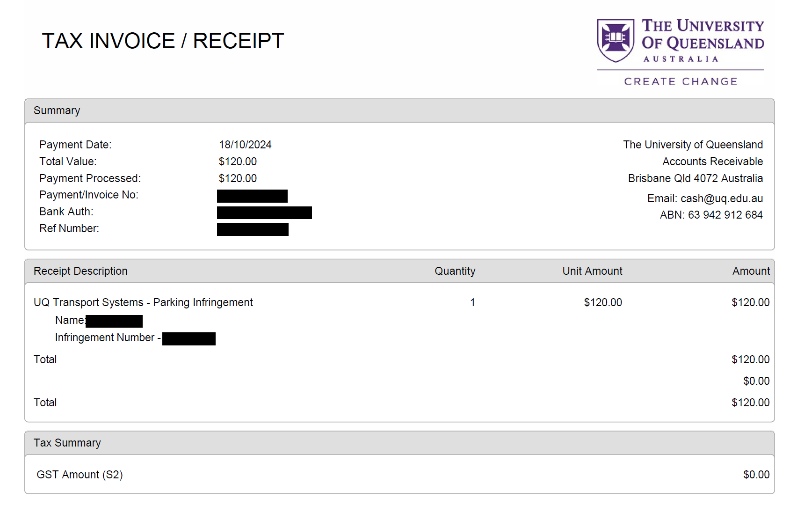

# ParkingReminderForIdiots
 傻逼，别忘记付停车费！（我是傻逼）

## 你现在可通过Google Play安装！
加入群组https://groups.google.com/g/qinlili_beta/  
然后点击此链接参与测试https://play.google.com/store/apps/details?id=moe.qinlili.parkingreminderforidiots  

## 项目介绍
本项目通过前台服务检测WIFI，当WIFI名称与预设相匹配时，发出通知或直接启动指定的APP  
本项目默认设置为检测UQ的WIFI，并启动CellOPark 

## 兼容性
自用项目，我自己的机器都是14+，所以最低需求Android 14  
没有任何版本判断，理论上对某些请求加个版本判断就能兼容低版本，但我懒得做，谁做了PR我就合并  

## 如何使用
下载Release中的APK或自行构建  
填写参数并保存即可  

## 为什么有这个项目
我是傻逼，我忘记付停车费被罚了120刀，我不想再做傻逼交傻逼税了，所以我写了这个项目  
  

## 为什么安装包这么小
啥库都没引，compat包都没有，全靠手搓，那能不小吗？现在一堆臭几把调包狗只会调包，用一个小功能就把整个包全引进来，一个包就是几百k，一个项目用了一百甚至九十个库，那能不大吗？不要重复造轮子不等于你可以为了要一个轮子买了一台车回来   

## 项目许可
MPLv2.0  
